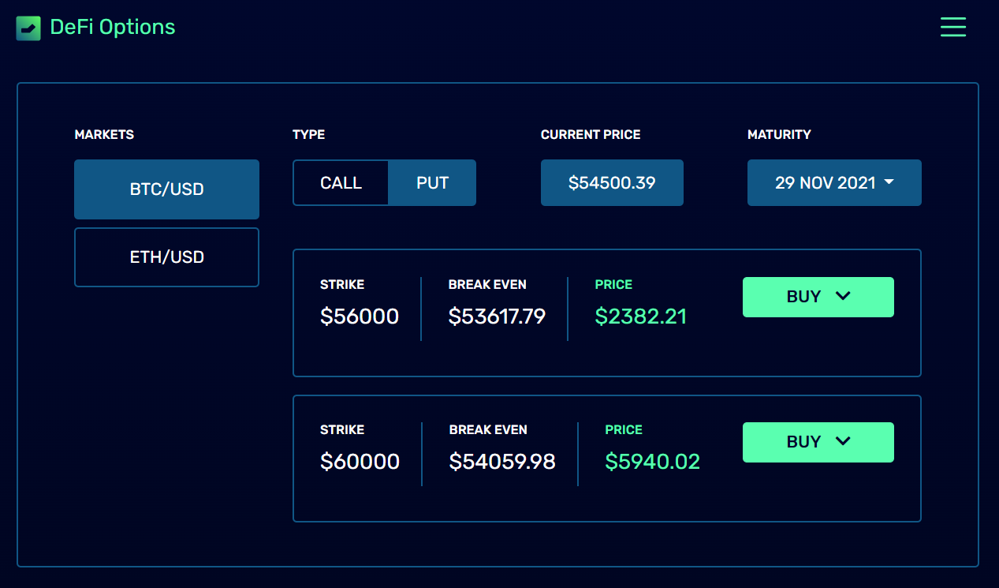

# DeFi Options

**DeFi Options** is an open source decentralized options trading platform targeted at Layer 1 and Layer 2 chains allowing users to buy, sell and write cash settable european call/put option tokens.

Our flexible structure allows traders to access or spin up their own on-chain peer-to-pool options trading liquidity pool where they control the rules (i.e set traded underlying assets, select price oracles, define pricing models, determine trading spreads, adjust permissions for traders and LPs, etc).

## Mission

To provide an attractive, dynamic environment for both options traders and options writers for trading not only crypto options, but also foreign exchange options, commodity options and more.‌

## Vision

Our protocol was built with scalability and flexibility in mind and will be able to support all Ethereum / EVM-compatible chains while bringing a more capital efficient collateral allocation model and a more diversified options offer to DeFi.

We believe options writers should be rewarded for absorbing the risk of issuing options. We also believe options buyers should have access to fair prices. And it has been with these beliefs in mind that we've designed the **DeFi Options** protocol.

We invite you to visit our [GitHub page](https://github.com/DeFiOptions) for reviewing our source code, and to join our [Discord Server](https://discord.gg/WCeKgHNz3z) for keeping up with the protocol's latest developments.
