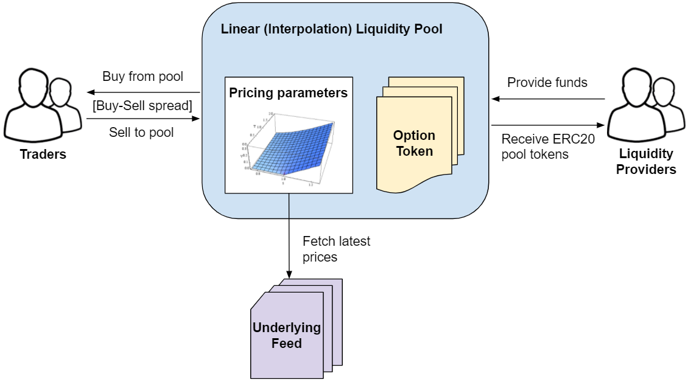

# Linear liquidity pool

This project provides a liquidity pool implementation that uses linear interpolation for calculating buy/sell option prices. The diagram below illustrates how the linear interpolation liquidity pool fits in the options exchange trading environment, how market agents interact with it, and provides some context on the pool pricing model:



The pool holds a pricing parameters data structure for each tradable option which contains a discretized pricing curve calculated off-chain based on a traditional option pricing model (ex: Monte Carlo) that’s “uploaded” to the pool storage. The pool pricing function receives the underlying price (fetched from the underlying price feed) and the current timestamp as inputs, then it interpolates the discrete curve to obtain the desired option’s target price.

A fixed spread is applied on top of the option’s target price for deriving its buy price above the target price, and sell price below the target price. This spread can be freely defined by the pool operator and should be high enough for ensuring the pool is profitable, but not too high as to demotivate traders.

### **Pool interface**

The following [liquidity pool interface](https://github.com/DeFiOptions/DeFiOptions-core/blob/master/contracts/interfaces/ILiquidityPool.sol) functions are provided for those willing to interact with the options exchange environment:

```
interface ILiquidityPool {

    function depositTokens(address to, address token, uint value) external;

    function listSymbols() external view returns (string memory);

    function queryBuy(string calldata optSymbol) external view returns (uint price, uint volume);

    function querySell(string calldata optSymbol) external view returns (uint price, uint volume);

    function buy(string calldata optSymbol, uint price, uint volume, address token)
        external
        returns (address addr);

    function sell(string calldata optSymbol, uint price, uint volume) external;
}
```

_Obs:_ [_EIP-2612 compatible_](https://eips.ethereum.org/EIPS/eip-2612) _ `buy` and `sell` functions are also provided for trading options in a single transaction._

Liquidity providers can call the `depositTokens` function for depositing compatible stablecoin tokens into the pool and receive pool tokens in return following a “post-money” valuation strategy, i.e., proportionally to their contribution to the total amount of capital allocated in the pool including the expected value of open option positions. This allows new liquidity providers to enter the pool at any time without harm to pre-existent providers.

Funds are locked in the pool until it reaches the pre-defined liquidation date, whereupon the pool ceases operations and profits are distributed to liquidity providers proportionally to their participation in the total supply of pool tokens.

The `listSymbols` function should be called to obtain the list of tradable options in the pool and returns a string containing all active option symbols, one per line. Symbols are encoded as follows:

* `[underlying symbol]/[base currency]-[type code]-[strike price]-[maturity]`

Where:

* The type code will be “EC” for European Call or “EP” for European Put.
* Strike price is provided in the base currency using a “1e18” decimal base. For instance, considering the USD base currency, 175e19 is equivalent to 1750e18 which in turn converts to 1750 USD.
* Maturity is provided as a Unix timestamp from epoch. For instance, 161784e4 is equivalent to 1617840000 which in turn converts to “GMT: Thursday, 8 April 2021 00:00:00”.

### **Buying from the pool**

Traders should first call the `queryBuy` function which receives an option symbol and returns both the spread-adjusted “buy” price and available volume for purchase from the pool, and then call the `buy` function specifying the option symbol, queried “buy” price, desired volume for purchase and the address of the stablecoin used as payment:

```
(uint buyPrice,) = pool.queryBuy(symbol);
uint volume = 1 * volumeBase;
stablecoin.approve(address(pool), price * volume / volumeBase);
pool.buy(symbol, price, volume, address(stablecoin));
```

### **Selling to the pool**

Likewise traders should first call the `querySell` function which receives an option symbol and returns both the spread-adjusted “sell” price and available volume the pool is able to purchase, and then call the `sell` function specifying the option symbol, queried “sell” price and the pre-approved option token transfer volume being sold:

```
(uint sellPrice,) = pool.querySell(symbol);
uint volume = 1 * volumeBase;

OptionToken token OptionToken(exchange.resolveToken(symbol));
token.approve(address(pool), price * volume / volumeBase);
pool.sell(symbol, price, volume);
```

Upon a successful transaction payment for the transferred option tokens is provided in the form of balance transferred from the pool account to the `msg.sender` account within the options exchange.
