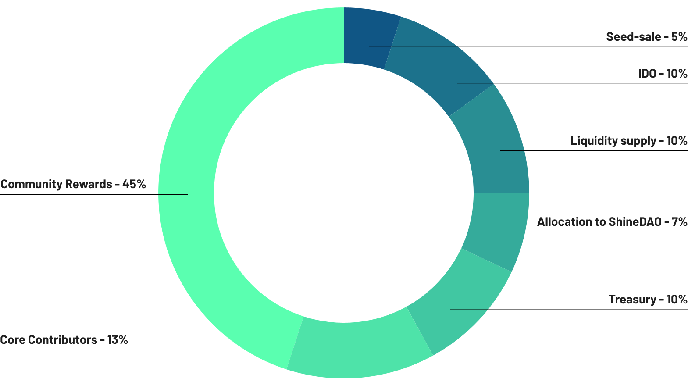

# DOD Token

DOD Contract Address on **Ethereum**: [0xfc7e3cfa47fbf90310ec203f46fee1af2771548c](https://etherscan.io/token/0xfc7e3cfa47fbf90310ec203f46fee1af2771548c?a=0x6950429826459dc2b8c3fcc1a07b6fb6eca192b9)

DOD Contract Address on **Polygon (Matic)**: [0x7e6663d14f058880fad199bcb745a81c46407809](https://polygonscan.com/token/0x7e6663d14f058880fad199bcb745a81c46407809?a=0xEea5B2889BF36695d45bFD2071c2499065831B0A)

## Token Utility

### Governance

DOD Token is a [#governance](dod-token.md#governance "mention") token that gives it's owners right to influence [protocol-settings.md](../protocol/governance/protocol-settings.md "mention") via [proposal-voting.md](../protocol/governance/proposal-voting.md "mention"). Please refer to [token-holders.md](../protocol/roles/token-holders.md "mention") for details.

### Contributor Rewards

[contributors.md](contributors.md "mention") can earn DOD for bringing value to the community.

### Community Rewards

🛠  - We are preparing several reward programs to incentivise early protocol usage, liquidity, security and staking.


DeFi Options DAO (DOD) tokens are utility tokens targeted solely at creating a community of supporters of the protocol. They don't hold any monetary value, nor can they be characterised as investment, shares or securities of any type. Owning DOD tokens doesn't entitle you any rights or guarantees of any kind. If you've swapped any other token or crypto to acquire DOD tokens be advised that you WON'T be refunded under any circumstances. Acquire DOD tokens at your own discretion. You are waiving your rights and agreeing to these terms and conditions if you decide to go further and become a holder of DOD tokens. If you are uncertain as to anything in this informative website or you are not prepared to lose all tokens or crypto that you swap for acquiring DOD tokens, we strongly urge you not to acquire any DOD tokens, not to engage with DOD.


## Token Economics

Total Supply: 100,000,000 DOD

Seed Sale Allocation: 5,000,000 DOD

Seed Sale Rate ≈ $0.015 / DOD

Seed Sale Total Raise: $75.000 (Used for [#audit](../security.md#audit "mention"))

Seed Sale Vesting period: 25% released form day 1, 75% unlocked after 100 days

