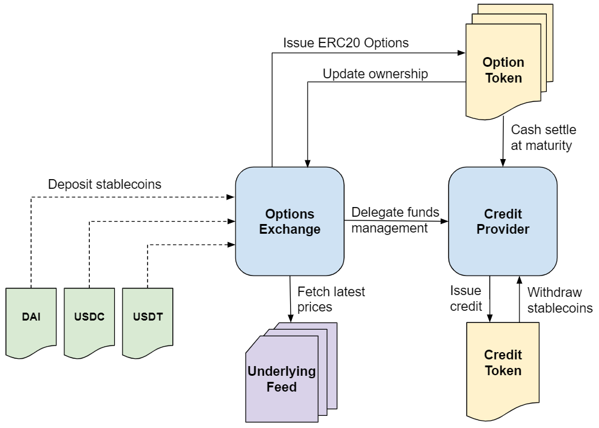

# Protocol Overview

The **Defi Options** exchange enables trading of long and short positions for cash settable call and put [european style options](https://en.wikipedia.org/wiki/Option\_style#American\_and\_European\_options).

It's been implemented as a collection of smart contracts written in the [solidity](https://en.wikipedia.org/wiki/Solidity) programming language. The diagram below gives a glimpse on how traders interact with the exchange, and how components interact with one another.

The exchange accepts stablecoin deposits as collateral for writing tokenized (ERC20) options, and a dynamic approach has been implemented for ensuring collateral in a more capital efficient way, making use of favorable writer's open option positions for decreasing total required balance provided as collateral.

Decentralized price feeds provide the exchange on-chain underlying price and volatility updates, which is crucial for properly calculating options intrinsic values, collateral requirements, and performing settlements.

Because options are tokenized they can be freely traded/transferred between any two parties. Upon maturity each option contract is liquidated and cash settled by the credit provider contract, becoming open for redemption by token holders. In case any option writer happens to be short on funds during settlement the credit provider will register a debt and cover payment obligations, essentially performing a lending operation.

Registered debt will accrue interest until it's repaid by the borrower. Payment occurs either implicitly when any of the borrower's open option positions matures and is cash settled (pending debt will be discounted from profits) or explicitly if the borrower makes a new stablecoin deposit in the exchange.

Exchange's balances not allocated as collateral can be withdrawn by respective owners in the form of stablecoins. If there aren't enough stablecoins available at the moment of the request due to operational reasons the solicitant will receive ERC20 credit tokens issued by the credit provider instead. These credit tokens are a promise of future payment, serving as a proxy for stablecoins since they can be redeemed for stablecoins at a 1:1 value conversion ratio, and are essential for keeping the exchange afloat during episodes of high withdrawal demand.

Holders of credit tokens can request to withdraw (and burn) their balance for stablecoins as long as there are sufficient funds available in the exchange to process the operation, otherwise the withdraw request will be FIFO-queued while the exchange gathers funds, accruing interest until it's finally processed to compensate for the delay.
