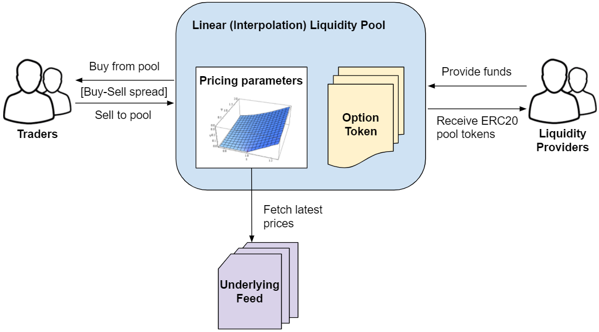

# Liquidity Pool

One could say that achieving efficient pricing is among the biggest challenges for implementing a successful liquidity pool. Typically the price of an asset varies according to supply and demand pressures. If there’s too much supply prices will drop, since sellers will compete against each other for offering the most competitive price. Likewise if demand is up to the roof prices will rise, since buyers will fight amongst themselves to offer the best price for purchasing an asset.

Several models have been proposed and are being used in DeFi to address this challenge. [Uniswap](https://en.wikipedia.org/wiki/Uniswap) liquidity pools famously use the constant product formula to automatically adjust cryptocurrencies exchange prices upon each processed transaction. In this case market participants are resposible for driving exchange rates up/down by taking advantage of short-lived arbitrage opportunities that appear when prices distantiate from their ideal values.

Nonetheless a supply/demand based pricing model, such as Uniswap’s, may be unfit for pricing options, since an option price is not entirely the result of supply and demand pressures, but rather directly dependent on its underlying’s price. This observation motivated **Defi Options** to propose a linear interpolation based liquidity pool model:

On one side of the table we have options traders that interact with the pool by either buying options from it or selling options to it. The pool first calculates the target price for an option based on its internal pricing parameters (more on that latter) and then applies a fixed spread on top of it for deriving the buy price above the target price, and sell price below the target price. This spread can be freely defined by the pool operator and should be high enough for ensuring the pool is profitable, but not too high as to demotivate traders.

On the other side of the table we have liquidity providers. They interact with the pool by depositing funds into it which are used to both **i)** allocate collateral for writing new option tokens for selling to traders and **ii)** allocate a reserve of capital for buying option tokens from traders.

**PS**: Notice that, even though the protocol provides the linear interpolation based pool implementation, the options exchange is completely independent / decoupled from liquidity pools. This brings up many possibilities such as the emergence of new liquidity pool designs from the community for addressing specific market requirements.
