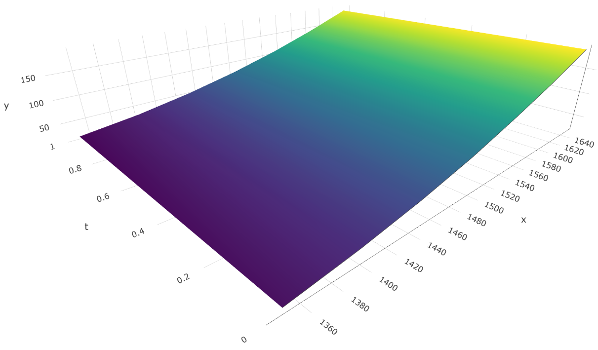

# Pricing Model

The pool holds a pricing parameters data structure for each tradable option which contains a discretized pricing curve calculated off-chain based on a traditional option pricing model (ex: Monte Carlo) that’s “uploaded” to the pool storage. The pool pricing function receives the underlying price (fetched from the underlying price feed) and the current timestamp as inputs, then it interpolates the discrete curve to obtain the desired option’s target price. That’s it, simple math.

The pricing curve is defined by two timestamps ("t0" and "t1") and two arrays ("x" and "y"). Let's take a look at an example:

```
 // underlying price points (US$)
x = [1350, 1400, 1450, 1500, 1550, 1600, 1650];

y = [
     // option price points for "t0" (US$)
    27, 42, 62, 87, 118, 152, 191,
    
    // option price points for "t1" (US$)
    22, 36, 56, 81, 111, 146, 185
];
```

This example snippet defines price points for a hypothetical ETH call option with strike price of US$ 1.500 and an interpolation period starting at 7 days to maturity ("t0") and ending at 6 days to maturity ("t1"), resulting in the pricing surface plotted below:



By following this approach the more heavy math is performed off-chain, since it would be unfeasible/too damn expensive to run a Monte Carlo simulation or any other option pricing method on ethereum, and actually a waste of capital, as interpolating a preprocessed discretized curve achieves similar end results with much less on-chain computational effort.
