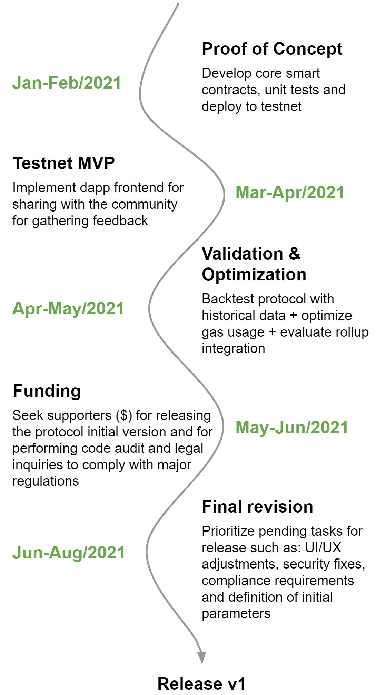

# Roadmap

Since **Defi Options** is an open source project adherence to the roadmap will be dependent upon the amount of contribution (e.g. involvement, resources) the project is able to attract.

Our roadmap is guided by the lean methodology, adopting a combination of business-hypothesis-driven experimentation, iterative product releases, and validated learning:

We are fast paced but without compromising quality and, more importantly, security.
